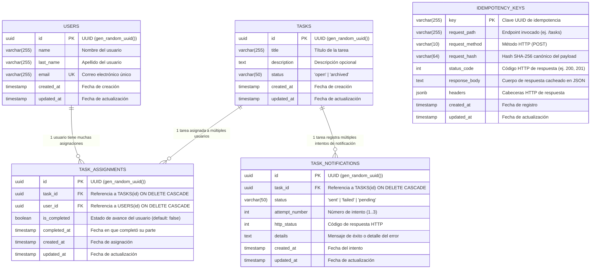
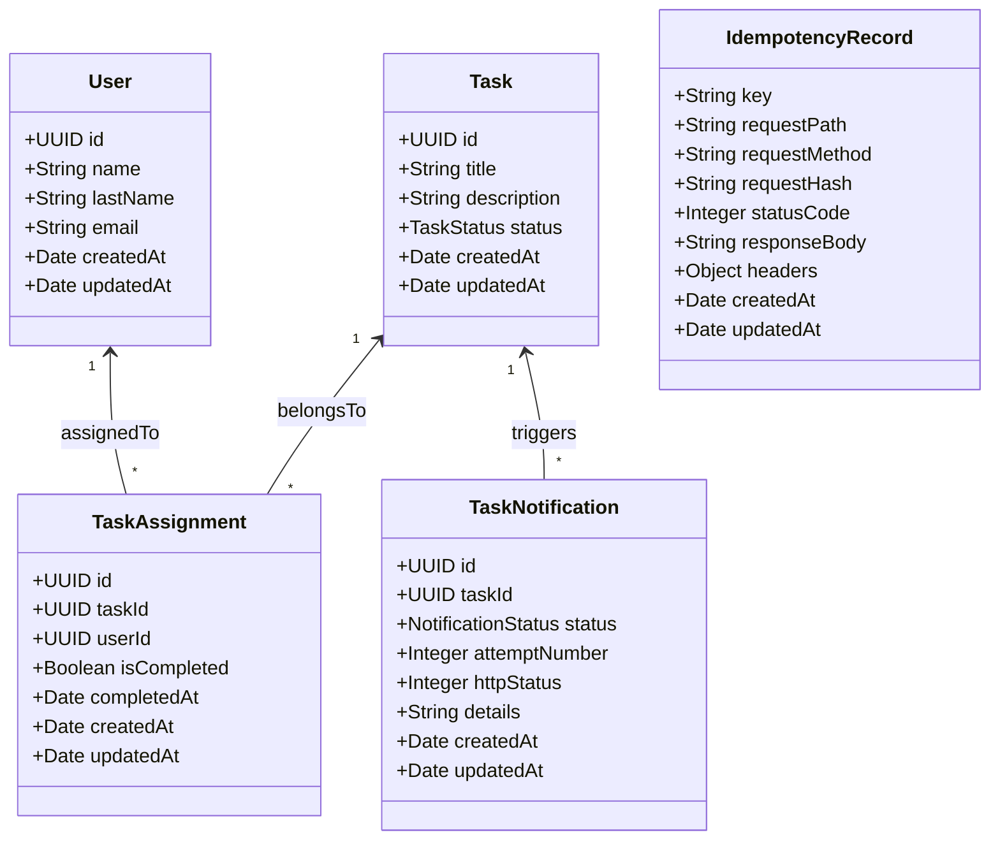

# Diagrama UML / ER — Base de Datos Geest API

Este documento detalla el modelo de datos relacional de **Geest API**, incluyendo el diagrama UML/ER en formato Mermaid, los tipos de datos, restricciones, claves primarias/foráneas y relaciones.

---

## 1. Diagrama Entidad-Relación / UML (Mermaid)

---

## 2. Diagrama de Clases UML (Estructura de Entidades)

---

## 3. Especificación Detallada de Tablas

### `users`
| Campo | Tipo | Nulo | Default | Restricciones / Notas |
|---|---|---|---|---|
| `id` | `UUID` | NO | `gen_random_uuid()` | Clave Primaria (PK) |
| `name` | `VARCHAR(255)` | NO | - | Nombre de usuario |
| `last_name` | `VARCHAR(255)` | NO | - | Apellido |
| `email` | `VARCHAR(255)` | NO | - | Único (`UNIQUE`), Índice `idx_users_email` |
| `created_at`| `TIMESTAMP` | NO | `CURRENT_TIMESTAMP` | Fecha de creación |
| `updated_at`| `TIMESTAMP` | NO | `CURRENT_TIMESTAMP` | Actualizado vía Trigger |

---

### `tasks`
| Campo | Tipo | Nulo | Default | Restricciones / Notas |
|---|---|---|---|---|
| `id` | `UUID` | NO | `gen_random_uuid()` | Clave Primaria (PK) |
| `title` | `VARCHAR(255)` | NO | - | Título de la tarea |
| `description` | `TEXT` | SÍ | `NULL` | Detalle o contexto opcional |
| `status` | `VARCHAR(50)` | NO | `'open'` | `CHECK (status IN ('open', 'archived'))`, Índice `idx_tasks_status` |
| `created_at`| `TIMESTAMP` | NO | `CURRENT_TIMESTAMP` | Fecha de creación |
| `updated_at`| `TIMESTAMP` | NO | `CURRENT_TIMESTAMP` | Actualizado vía Trigger |

---

### `task_assignments`
| Campo | Tipo | Nulo | Default | Restricciones / Notas |
|---|---|---|---|---|
| `id` | `UUID` | NO | `gen_random_uuid()` | Clave Primaria (PK) |
| `task_id` | `UUID` | NO | - | FK &rarr; `tasks(id)` `ON DELETE CASCADE` |
| `user_id` | `UUID` | NO | - | FK &rarr; `users(id)` `ON DELETE CASCADE` |
| `is_completed` | `BOOLEAN` | NO | `FALSE` | Bandera de progreso del usuario |
| `completed_at` | `TIMESTAMP` | SÍ | `NULL` | Fecha en que el usuario completó su parte |
| `created_at`| `TIMESTAMP` | NO | `CURRENT_TIMESTAMP` | Fecha de creación |
| `updated_at`| `TIMESTAMP` | NO | `CURRENT_TIMESTAMP` | Actualizado vía Trigger |

* **Constraint única:** `UNIQUE (task_id, user_id)` (un usuario no puede estar asignado repetidamente a la misma tarea).
* **Índices:** `idx_task_assignments_task_id`, `idx_task_assignments_user_id`, `idx_task_assignments_status (user_id, is_completed)`.

---

### `task_notifications`
| Campo | Tipo | Nulo | Default | Restricciones / Notas |
|---|---|---|---|---|
| `id` | `UUID` | NO | `gen_random_uuid()` | Clave Primaria (PK) |
| `task_id` | `UUID` | NO | - | FK &rarr; `tasks(id)` `ON DELETE CASCADE` |
| `status` | `VARCHAR(50)` | NO | `'sent'` | `CHECK (status IN ('sent', 'failed', 'pending'))` |
| `attempt_number` | `INT` | NO | `1` | Intento actual (1, 2 o 3) |
| `http_status` | `INT` | SÍ | `NULL` | Código de estado HTTP retornado por `NOTIFY_URL` |
| `details` | `TEXT` | SÍ | `NULL` | Detalle o mensaje de error en caso de fallo |
| `created_at`| `TIMESTAMP` | NO | `CURRENT_TIMESTAMP` | Fecha de ejecución del intento |
| `updated_at`| `TIMESTAMP` | NO | `CURRENT_TIMESTAMP` | Actualizado vía Trigger |

---

### `idempotency_keys`
| Campo | Tipo | Nulo | Default | Restricciones / Notas |
|---|---|---|---|---|
| `key` | `VARCHAR(255)` | NO | - | Clave Primaria (PK) enviada en header `Idempotency-Key` |
| `request_path` | `VARCHAR(255)` | NO | - | Ruta de la petición |
| `request_method` | `VARCHAR(10)` | NO | - | Método (`POST`) |
| `request_hash` | `VARCHAR(64)` | NO | - | Hash SHA-256 del cuerpo |
| `status_code` | `INT` | NO | - | Código HTTP retornado |
| `response_body`| `TEXT` | NO | - | Payload serializado devuelto |
| `headers` | `JSONB` | SÍ | `NULL` | Cabeceras adicionales si aplica |
| `created_at`| `TIMESTAMP` | NO | `CURRENT_TIMESTAMP` | Índice `idx_idempotency_keys_created_at` |
| `updated_at`| `TIMESTAMP` | NO | `CURRENT_TIMESTAMP` | Actualizado vía Trigger |
